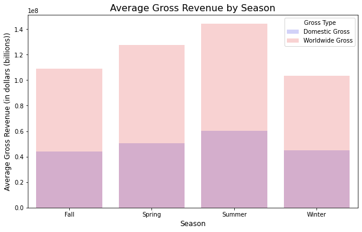
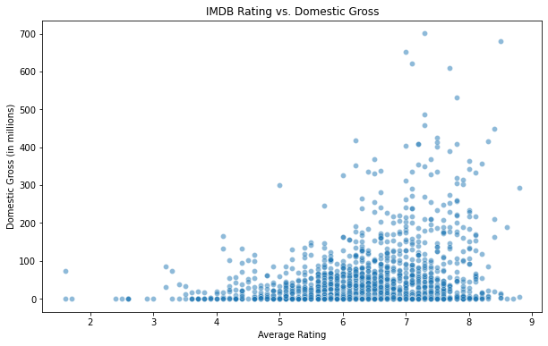
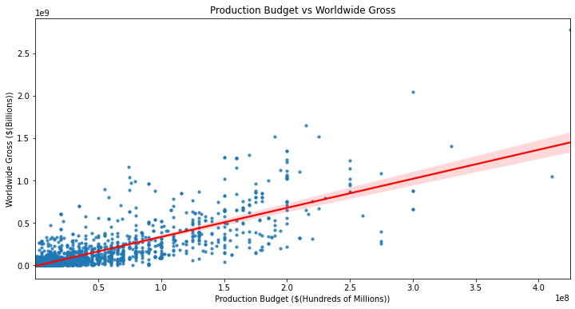

**PROJECT TITLE: DATA DRIVEN INSIGHTS TO LAUNCH A SUCCESSFUL MOVIE STUDIO**

**Business Understanding**

The company recognizes the growing trend of major organizations creating original video content and aims to establish a new movie studio to capitalize on this opportunity. However, with limited knowledge about the movie industry, the company seeks to understand the current dynamics of the box office to inform strategic decisions. 

The primary goal is to explore which types of films achieve the greatest success, focusing on identifying top-performing genres and themes, understanding audience preferences across demographics and regions, and evaluating seasonal and regional trends that influence box office performance. These findings will be translated into actionable insights to guide the creation of impactful and competitive movie content.

**Project Overview**

The project entails how we carried out Exploratory Data Analysis on several datasets to uncover patterns and insights that gave us informed decisions based on our findings.  

**Objectives** 
1. Identify Top-Performing Movie Genres Analyze which genres (e.g., Action, Comedy, Drama) consistently generate the highest box office revenue to guide future content strategy.
2. Evaluate seasonal and regional trends 
3. Identify movie ratings and audience preferences for various genres
4. Analyze the relationship between production budget and worldwide revenue

**Loading and Understanding the Data**

- Importing the Data with the necessary libraries, recognizing the
    rows and columns of the dataset, inspecting for duplicates and
    identifying missing values.
- The dataframes loaded included: 
    - box_office_mojo (CSV)
    - the_movies_db (CSV)
    - movie_numbers (CSV)
    - movie_ratings (SQL)
    - movie_basics (SQL)

**Cleaning and Normalizing the Data**

- Dropping of unnecessary columns for driven analysis.
- Replacing and filling missing values.
- Changing column data types to proper and easily manageable data types. 

**Data Analysis**

**1. Hypothesis Testing**

Null Hypothesis (H₀)
"There is no significant relationship between a movie's average audience rating and its worldwide gross revenue."
This suggests that variations in audience ratings do not have any meaningful effect on a movie's revenue.

Alternative Hypothesis (H₁)
"There is a significant relationship between a movie's average audience rating and its worldwide gross revenue."
This implies that audience ratings and worldwide revenue are statistically associated, indicating that higher ratings might correlate with higher revenue or vice versa.

**2. Data Visualiation**

Objective 1: Top-Performing Movie Genres
Analyzes which genres (e.g., Action, Comedy, Drama) consistently generate the highest box office revenue to guide future content strategy.

 

Objective 2: Evaluate seasonal and regional trends 
Gross Revenue by Season

Objective 3: Identify movie ratings and audience preferences for various genres

Objective 4: Analyze the relationship between production budget and worldwide revenue

***Conclusions**

- Focus on high performing genres which include adventure, action and mystery which had the 3 highest average domestic gross. 

- Average gross revenue by season shows that Summer has the highest average worldwide and domestic gross, followed by Spring. Winter and Fall have comparatively lower average gross revenues.

- The movies with rating more than 8 had the most average domestic gross. 

- Production budgets between $50m and $150m has a higher worldwide gross.

**Recommendations**

- Launch with mid-budget Blockbusters which are action and adventure between May and July.

- Launch movies around summer season for more gross revenues.

- Focus on genres of movies with higher average ratings so as to have more domestic gross.

- When making movies, focus on the genres of movies with higher ratings for more domestic gross. 

- Averagely rated movies make the most money domestically.

- Focus on mid sized production budgets between $50m and $150m to optimize return on investment and avoid high risk. 
